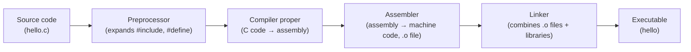
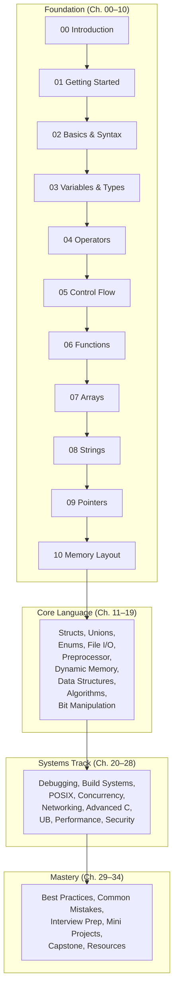
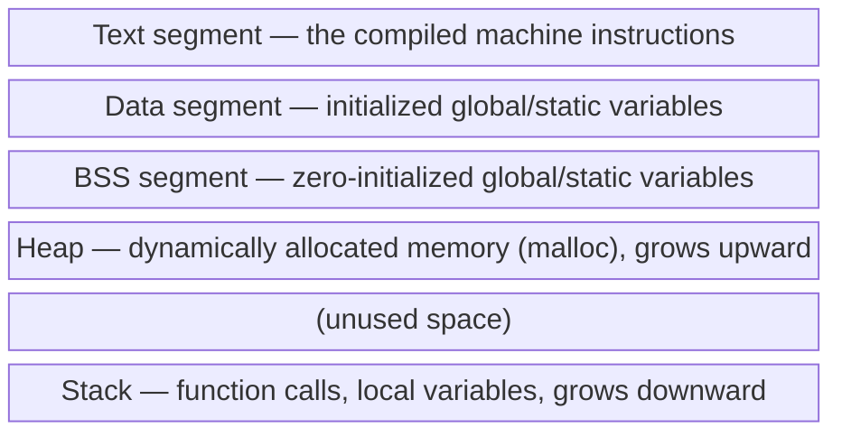

# 00 — Introduction to C

## Learning Objectives

By the end of this chapter, you will be able to:

- Explain what a program actually is, at the level of bytes and instructions, not just "code that does stuff."
- Describe the origin of C, why it was created, and why that history still shapes the language you're about to learn.
- Explain the difference between compiled and interpreted languages, and where C sits.
- Trace, at a high level, what happens between typing `gcc file.c` and a program running on your CPU.
- Understand why C remains foundational to operating systems, embedded systems, and nearly every other language's runtime.
- Use this repository as a structured course rather than a loose pile of notes.

## Prerequisites

None. This chapter assumes zero prior programming experience. If you've never written a line of code before, you are exactly the intended reader.

## Estimated Study Time

2–3 hours, including reading, diagram review, and the reflection exercises at the end of this chapter (there is no code to write yet — that begins in Chapter 01).

---

## Theory

### What Programming Actually Is

A CPU does not understand C. It does not understand Python, Java, or English. A CPU understands one thing: sequences of binary numbers called **machine instructions** — things like "add these two register values," "move this value from memory to a register," or "jump to a different instruction if this value is zero."

Programming, at its core, is the act of describing a sequence of these primitive operations precisely enough that a machine can carry them out, to produce a result a human cares about — a sorted list, a rendered webpage, a message sent across a network.

The difficulty of programming is not that computers are complicated. Individually, machine instructions are almost embarrassingly simple. The difficulty is that humans think in terms of goals ("sort this list of names alphabetically") while computers only execute in terms of tiny, literal steps ("compare byte at address X to byte at address Y; if greater, swap"). A programming language exists to bridge that gap — to let a human express a goal in a form structured enough that a piece of software (a **compiler** or **interpreter**) can mechanically translate it into the machine's literal steps.

C sits close to the machine. It gives you enough abstraction to write "if (x > y)" instead of the equivalent raw comparison instruction, but it does not hide memory, arithmetic on addresses, or the fact that your data occupies real, finite storage. This is precisely why C is taught before higher-level languages in serious computer science curricula: it forces you to understand what's actually happening, rather than trusting a runtime to handle it invisibly.

### A Brief History of C

C did not appear in a vacuum, and understanding where it came from explains several of its design decisions that otherwise look strange.

**Bell Labs, late 1960s.** Bell Telephone Laboratories was running a research project called Multics (Multiplexed Information and Computing Service) — an ambitious, and ultimately commercially unsuccessful, operating system project. When Bell Labs withdrew from Multics in 1969, two researchers who had worked on it — **Ken Thompson** and **Dennis Ritchie** — decided to build a smaller, simpler operating system of their own, largely so Thompson could keep playing a game he'd written called "Space Travel" on a spare PDP-7 minicomputer.

That operating system became **UNIX**.

The first version of UNIX was written in PDP-7 assembly language — instructions specific to that one machine. Assembly is fast but brutally unportable: code written for one CPU architecture cannot run on another without being rewritten from scratch. Thompson first tried designing a language called **B**, derived from an earlier language called BCPL (Basic Combined Programming Language), to make UNIX development less painful. B worked, but it had a significant limitation: it was a "typeless" language, treating all data as machine words, which made it awkward for working with different-sized data — bytes, characters, larger integers — efficiently.

Between 1969 and 1973, Dennis Ritchie evolved B into a new language, adding a proper type system (`char`, `int`, and later structures) while preserving B's low-level, close-to-the-machine philosophy. He called it **C** — quite literally, the next letter after B.

In 1973, Ritchie and Thompson rewrote the UNIX kernel itself in C. This was a radical decision at the time: operating systems were assumed to require hand-tuned assembly for performance. Proving that an OS kernel could be written in a portable, higher-level language — and still be fast — was one of the most consequential demonstrations in computing history. It meant UNIX could be **ported** to new hardware by rewriting only the C compiler and a small assembly bootstrap layer, rather than rewriting the entire OS. This portability is a direct reason UNIX (and its descendants: Linux, BSD, macOS's Darwin core) spread as widely as it did.

In 1978, Ritchie and **Brian Kernighan** published *The C Programming Language*, often called "K&R" after its authors' initials. It became the de facto specification for the language for nearly a decade, before the language was formally standardized.

**Standardization.** As C spread beyond Bell Labs, compiler vendors began introducing incompatible extensions. To prevent fragmentation, the American National Standards Institute standardized the language in 1989 (commonly called **C89** or **ANSI C**), with an equivalent ISO standard following in 1990 (**C90**). The language has continued to evolve through further standards:

| Standard | Year | Notable additions |
|---|---|---|
| K&R C | 1978 | The original, pre-standard language |
| C89 / C90 | 1989 / 1990 | First formal standard; function prototypes |
| C99 | 1999 | `//` comments, variable-length arrays, `stdint.h`, `inline` |
| C11 | 2011 | `_Generic`, atomics, threads, anonymous structs/unions |
| C17 | 2018 | Bug-fix release to C11; no new features |
| C23 | 2024 | `nullptr`, `typeof`, `#embed`, boolean type built in |

This repository primarily teaches **C17/C23-era C**, using modern tooling and modern warnings, while flagging older conventions (like pre-C99 variable declaration rules) where you're likely to encounter them in existing codebases.

### Why C Still Matters

It is fair to ask: if C is over 50 years old, why learn it instead of a newer language?

- **Operating systems.** The Linux kernel, most of the Windows NT kernel, and large parts of macOS/iOS (through Darwin and low-level frameworks) are written in C or C-adjacent languages. If you want to understand how your OS actually works, C is the language it's written in.
- **Language runtimes.** CPython (the reference Python implementation), the core of Ruby's MRI, Lua, and SQLite are all implemented in C. Learning C tells you what's really happening underneath languages that feel "invisible" about memory.
- **Embedded systems.** Microcontrollers running in cars, medical devices, routers, and industrial equipment are overwhelmingly programmed in C, because it gives predictable, minimal-overhead control over hardware with no garbage collector or heavy runtime.
- **Performance-critical systems.** Databases, codecs, game engines, and networking stacks frequently drop to C (or C++) where every cycle and every byte matters.
- **It teaches transferable understanding.** Once you understand pointers, memory layout, and manual memory management in C, concepts in every other language — garbage collection, references versus values, why some operations are slow — become dramatically easier to reason about, because you've seen what's happening without the abstraction.

C is not usually the best choice for a new web application or a mobile app in 2026. But it is very often the right choice — or the only choice — one or two layers below whatever tool you'd reach for on top.

### How Computers Execute Programs

Before writing a line of C, it helps to have a working mental model of what a computer is actually doing.

At the hardware level, a CPU repeatedly executes a cycle called **fetch-decode-execute**:

1. **Fetch** — read the next instruction from memory, at the address held in a special register called the program counter.
2. **Decode** — figure out what operation the instruction represents (add, load, jump, compare, etc.) and which operands (registers or memory addresses) it needs.
3. **Execute** — perform the operation, and update the program counter to point at the next instruction (or jump elsewhere, for branches and loops).

This cycle runs billions of times per second on a modern CPU. Every abstraction you'll learn in this course — variables, loops, functions, structs — ultimately compiles down to sequences of these fetch-decode-execute cycles.

**Compiled versus interpreted languages.** Languages differ in *when* human-readable source code gets turned into instructions the CPU can execute:

- A **compiled** language (C, C++, Rust, Go) is translated entirely into machine code by a compiler *before* the program runs. The output is a standalone executable file containing real CPU instructions.
- An **interpreted** language (classic Python, Ruby, shell scripts) is read and executed line-by-line at runtime by another program (the interpreter), which itself is usually a compiled program.
- Some languages (Java, C#, modern JavaScript engines) use a **hybrid** approach: source is compiled to an intermediate form (bytecode), which is then either interpreted or compiled further at runtime by a Just-In-Time (JIT) compiler.

C is compiled. This means:

- Your program runs directly on the CPU with no intermediary translating instructions at runtime — this is a major reason C programs are typically fast.
- Mistakes that a compiler can catch (type mismatches, missing declarations) are caught *before* your program ever runs, rather than causing a crash mid-execution.
- You must go through an explicit build step (covered fully in Chapter 01) every time you change your code, unlike interpreted languages where you can just re-run a script.

### The Compilation Pipeline, at a Glance

Turning a `.c` file into a running program is not a single step. It's a pipeline with four distinct stages. Chapter 01 covers each stage in depth with real commands; here, focus on the shape of the pipeline.

Each stage transforms the program into a form one step closer to raw machine instructions:

1. **Preprocessing** handles anything starting with `#` — `#include`, `#define`, conditional compilation — as pure text substitution, before any C syntax is even understood.
2. **Compilation proper** translates the preprocessed C code into assembly language: human-readable-ish mnemonics that map closely to actual CPU instructions.
3. **Assembly** converts that assembly text into an **object file** — actual binary machine code, but not yet a runnable program, because it may reference functions (like `printf`) defined elsewhere.
4. **Linking** resolves those references, combining your object file with the C standard library (and any other object files) into a single, complete, runnable executable.

### Learning Roadmap

This repository is organized as a sequence of 34 chapters, grouped into rough tiers of difficulty. This chapter (00) and the next nine build the foundation; everything after Chapter 10 assumes you're comfortable with the material up to and including memory layout.

Notice that **Pointers (09)** and **Memory Layout (10)** sit at the very end of the Foundation tier, not the beginning. This is intentional. Pointers are the single biggest conceptual hurdle for C beginners, and they make far more sense once you already understand variables, arrays, and functions — since a pointer is, fundamentally, just a variable that holds a memory address, and "memory address" only means something once you've seen how variables occupy memory in the first place.

---

## Concepts

### Why C's Design Choices Exist

A few design decisions in C only make sense in light of its history and goals:

- **No garbage collector.** C was designed to write an operating system kernel. A kernel cannot pause the entire machine periodically to reclaim unused memory — that decision must be explicit and predictable, which is why C requires you to call `free()` yourself (covered in Chapter 16).
- **Minimal runtime.** C programs start executing almost immediately, with very little hidden setup code running before `main()`. This matters enormously for embedded systems with limited resources.
- **Direct memory access.** C lets you read and write memory addresses directly through pointers, because an operating system fundamentally *is* a program that manipulates memory, hardware registers, and other low-level resources directly.
- **Small standard library.** C's built-in library is deliberately minimal compared to Python's or Java's, reflecting its origins as a systems language meant to run everywhere, including on hardware with almost no resources to spare on a large runtime.

### How This Differs From Other Languages

If you've dabbled in Python or JavaScript before, several things will feel different:

- **You must declare a variable's type**, and that type cannot change later. Python lets a variable hold an integer, then a string, then a list; C does not.
- **There is no automatic bounds checking.** Accessing an array outside its valid indices doesn't raise a friendly exception — it invokes **undefined behavior**, a concept you'll meet formally in Chapter 26, but which in practice can mean anything from a crash to silently corrupted data.
- **Memory is your responsibility.** When you're done with dynamically allocated memory, you must explicitly release it, or your program leaks memory for as long as it runs.
- **The compiler is a static analysis tool, not just a translator.** Compiler warnings (which you'll enable in Chapter 01 with `-Wall -Wextra`) catch entire categories of bugs before your program ever runs — take them seriously from day one.

None of this makes C "harder" in some vague sense; it makes C more explicit. Everything a higher-level language does for you automatically, C makes you do by hand — which is exactly why learning it teaches you what those other languages are quietly doing on your behalf.

---

## Memory Visualization

You don't have variables to visualize yet — that begins in Chapter 03, and full memory layout is covered exhaustively in Chapter 10. For now, it's enough to know that a running C program's memory is divided into distinct regions, each with a different purpose and lifetime:

Every C program you ever write lives somewhere in this picture. Keep this diagram in the back of your mind; Chapter 10 will return to it in full detail, with real addresses and worked examples.

---

## Linux Focus

This course is Linux-first: every example, build instruction, and debugging technique assumes you're working in a Linux environment (or WSL, or a Linux VM, if you're on Windows). Chapter 01 walks through installing everything below; for now, just know the names of the tools you'll be using throughout this course:

- **gcc** / **clang** — the two compilers you'll use to turn C source into executables.
- **make** — a build automation tool for multi-file projects (Chapter 21).
- **gdb** — the GNU Debugger, for stepping through running programs (Chapter 20).
- **valgrind** — a tool that detects memory leaks and invalid memory access (Chapter 16, Chapter 20).
- **clang-format** — automatic code formatting, so style arguments never happen (Chapter 29).
- **cppcheck** — static analysis that catches bugs beyond what compiler warnings alone find.

---

## Common Mistakes

Full detail lives in `common-mistakes.md`, but two misconceptions are worth addressing before you write any code:

1. **"C is an old, outdated language, so why bother."** C's standard continues to actively evolve (C23 was finalized in 2024), and it remains the implementation language for the software everything else runs on top of. "Old" and "obsolete" are not the same thing — C is more like a foundational tool than a legacy one.
2. **"I should skip the fundamentals and jump straight to projects."** Skipping variables, control flow, and functions to jump straight into pointers or projects is the single most common reason beginners get stuck and quit. Each chapter in this course builds directly on the one before it — resist the urge to skip ahead.

---

## Best Practices

Before you write a single line of C, adopt these habits — they'll save you far more time than they cost:

- **Compile with warnings on, always**, starting in Chapter 01 (`-Wall -Wextra`). Treat every warning as a bug report from the compiler, not a suggestion.
- **Read error messages from the top down.** A single mistake (like a missing `}`) can cause a cascade of confusing errors below it — always fix the *first* error first, then recompile.
- **Type code out yourself; don't copy-paste.** Typing forces you to notice syntax, semicolons, and structure in a way that copying does not.
- **Keep a running note of things that confused you.** This repository's `common-mistakes.md` files exist because these mistakes are extremely common and predictable — you are not the first person to make them, and you won't be the last.

---

## Exercises

See `exercises.md` for this chapter's exercises. Since you haven't written any C code yet, this chapter's exercises are conceptual and research-based — you'll start writing real code in Chapter 01.

## Quiz

See `quiz.md` for a 20-question quiz covering this chapter's material.

## Cheat Sheet

See `cheatsheet.md` for a one-page summary of this chapter.

## References

See `resources.md` for a curated list of authoritative sources referenced in this chapter.
