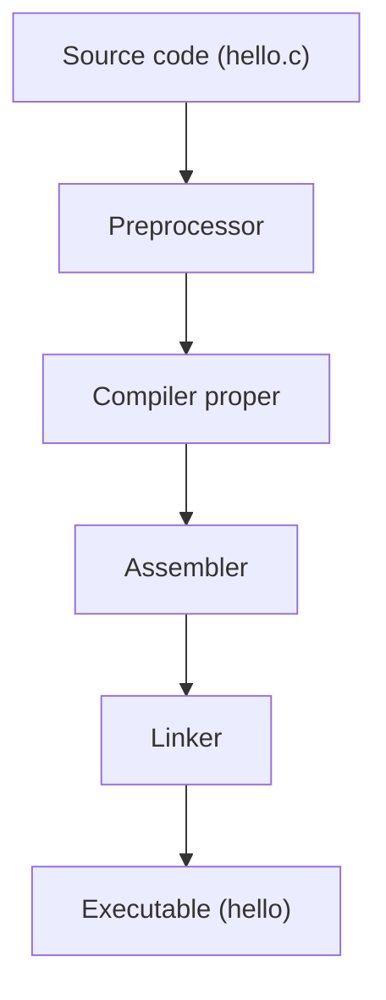

# README.md

# Introduction

Chapter 00 gave you the history and theory behind C. This chapter gets your hands on a keyboard. By the end of it, you will have a working C toolchain installed, you will have compiled and run your first program, and — more importantly — you will understand *what actually happens* between typing `gcc hello.c` and seeing `Hello, World!` printed on your screen.

This chapter is deliberately tool-heavy. Programming is a craft, and crafts require understanding your tools intimately, not just knowing which button to press. Every flag, every stage of compilation, and every installation step here is explained, not just listed.

# Learning Objectives

By the end of this chapter, you will be able to:

- Install and verify a working GCC and Clang toolchain on Linux.
- Set up a C-capable editor (VS Code, Neovim, or Code::Blocks) with sensible defaults.
- Explain, stage by stage, what happens during preprocessing, compilation, assembly, and linking.
- Write, compile, and run a C program entirely from the command line, with no IDE required.
- Read and act on GCC/Clang warnings and errors, rather than being intimidated by them.
- Explain what each of `-Wall`, `-Wextra`, `-Wpedantic`, `-g`, `-O0`, `-O2`, `-O3`, and `-std=c23` does, and why you should almost always use several of them together.
- Recognize a Makefile well enough to run one, ahead of the full treatment in Chapter 21.

# Prerequisites

Chapter 00 (Introduction). No prior programming experience is assumed. A Linux system, Windows Subsystem for Linux (WSL), or a Linux virtual machine is assumed for all terminal commands in this chapter.

# Estimated Study Time

4–6 hours, including toolchain installation, working through every code example by typing it yourself, and completing the exercises.

# Theory

A **toolchain** is the complete set of programs required to turn source code into a running executable: a compiler, an assembler, a linker, and usually a debugger and build tool alongside them. On Linux, the two toolchains you'll use throughout this course are built around **GCC** (the GNU Compiler Collection) and **Clang** (part of the LLVM project).

You do not need to pick one permanently. Professional C developers routinely compile the same code with both, precisely because each has slightly different warning behavior and catches slightly different classes of mistakes. Where one compiler stays silent, the other sometimes speaks up.

> [!TIP]
> Throughout this course, when an example shows `gcc`, try running the same command with `clang` afterward. Comparing their output is one of the fastest ways to build intuition for what's *your* bug versus what's compiler-specific behavior.

---

# Installing GCC

On most Linux distributions, GCC is available directly from the system package manager.

**Debian / Ubuntu:**

```bash
sudo apt update
sudo apt install build-essential
```

`build-essential` is a metapackage that pulls in GCC, the standard C library headers, `make`, and other essentials — installing it alone is normally sufficient to start this course.

**Fedora:**

```bash
sudo dnf install gcc make
```

**Arch Linux / openSUSE Tumbleweed:**

```bash
# Arch
sudo pacman -S base-devel

# openSUSE
sudo zypper install -t pattern devel_C_C++
```

Verify the install:

```bash
gcc --version
```

Expected output looks similar to (exact version numbers will differ):

```
gcc (Ubuntu 13.2.0-4ubuntu3) 13.2.0
Copyright (C) 2023 Free Software Foundation, Inc.
```

If you see a `command not found` error instead, the installation did not complete — re-run the package manager command above and check for errors during installation.

# Installing Clang

**Debian / Ubuntu:**

```bash
sudo apt install clang
```

**Fedora:**

```bash
sudo dnf install clang
```

**Arch Linux:**

```bash
sudo pacman -S clang
```

**openSUSE:**

```bash
sudo zypper install clang
```

Verify:

```bash
clang --version
```

# Installing Code::Blocks

Code::Blocks is a lightweight, C/C++-specific IDE that bundles an editor, compiler configuration, and debugger integration in one application. It's a reasonable choice if you want a graphical "single application" experience rather than assembling an editor and terminal separately.

**Debian / Ubuntu:**

```bash
sudo apt install codeblocks
```

**Fedora:**

```bash
sudo dnf install codeblocks
```

After installing, launch Code::Blocks, go to **Settings → Compiler**, and confirm it has detected GCC automatically (it usually does on Linux, since it searches your `PATH`).

> [!WARNING]
> This course's examples all use the command line directly, not Code::Blocks' GUI build buttons. If you use Code::Blocks, still practice compiling manually from a terminal at least occasionally — you need to understand what the IDE is doing on your behalf, not just trust the button.

# Installing VS Code

Visual Studio Code is a general-purpose editor, not a C-specific IDE, but with the right extensions it becomes an excellent C development environment.

1. Download VS Code from your distribution's package manager or the official Microsoft repository, e.g. on Debian/Ubuntu:

```bash
sudo apt install code
```

(If `code` isn't available in your default repositories, follow your distribution's instructions for adding the Microsoft VS Code repository.)

2. Launch VS Code and install these extensions from the Extensions view (`Ctrl+Shift+X`):
   - **C/C++** (by Microsoft) — IntelliSense, debugging, code browsing.
   - **C/C++ Extension Pack** — bundles the above with CMake Tools and other useful additions.

3. Open a folder containing your C files (`File → Open Folder`), not individual files — this lets VS Code correctly index your project.

# Installing Neovim

Neovim is a terminal-based, highly configurable text editor, popular among systems programmers who prefer to stay entirely within the terminal.

**Debian / Ubuntu:**

```bash
sudo apt install neovim
```

**Arch Linux:**

```bash
sudo pacman -S neovim
```

**openSUSE:**

```bash
sudo zypper install neovim
```

A minimal, useful setup for C development in Neovim requires a plugin manager (such as `lazy.nvim`) and a language server. Install `clangd` alongside Neovim:

```bash
sudo apt install clangd     # Debian/Ubuntu
sudo dnf install clang-tools-extra   # Fedora
```

`clangd` provides autocompletion, inline error checking, and go-to-definition — the same features an IDE like VS Code gives you, but through the Language Server Protocol, usable from any editor that speaks it, including Neovim and Vim.

> [!TIP]
> A full Neovim configuration is beyond the scope of this chapter. If you're already a Neovim user, adding `clangd` support to your existing configuration (via `nvim-lspconfig` or similar) is normally a few lines. If you're new to Neovim, VS Code is a gentler starting point for this course — you can always switch editors later without affecting anything else you learn here.

# Installing build tools

Two additional tools you'll use starting in this chapter and throughout the course:

```bash
# Debian/Ubuntu
sudo apt install make gdb valgrind

# Fedora
sudo dnf install make gdb valgrind

# Arch
sudo pacman -S make gdb valgrind

# openSUSE
sudo zypper install make gdb valgrind
```

- **make** — automates multi-file builds (previewed later in this chapter, covered fully in Chapter 21).
- **gdb** — the GNU Debugger, for inspecting a running or crashed program (Chapter 20).
- **valgrind** — detects memory leaks and invalid memory access (Chapters 16 and 20).

# Directory structure

Create a working directory for this course's exercises, kept separate from the repository itself if you cloned `c-learning-notes`:

```
~/c-practice/
├── ch01_getting_started/
│   ├── hello.c
│   └── Makefile
├── ch02_basics/
└── ...
```

A simple, consistent convention — one folder per chapter, one `.c` file per exercise or example — will save you time as this course progresses and you accumulate dozens of small programs.

# Writing the first program

Open your editor of choice and create a file named `hello.c`:

```c
#include <stdio.h>

int main(void) {
    printf("Hello, World!\n");
    return 0;
}
```

Every line here does specific, necessary work:

- `#include <stdio.h>` — a **preprocessor directive** that pulls in the declarations for the Standard Input/Output library, including `printf`. Without this line, the compiler has no idea what `printf` is.
- `int main(void)` — the **entry point** of every C program. Execution begins here. `int` means this function returns an integer value to the operating system; `void` means it takes no arguments.
- `printf("Hello, World!\n");` — calls the `printf` function, passing it a string literal to print. `\n` is an escape sequence representing a newline character.
- `return 0;` — returns the value `0` to the operating system, which is the conventional way of signaling "this program finished successfully." Non-zero return values conventionally indicate an error occurred.
- The curly braces `{ }` delimit the **body** of the `main` function — everything the function does when it runs.

# Hello World

Compile and run it:

```bash
gcc hello.c -o hello
./hello
```

Expected output:

```
Hello, World!
```

Breaking down the compile command:

- `gcc` invokes the GCC compiler.
- `hello.c` is the source file to compile.
- `-o hello` tells GCC to name the output executable `hello` (without this flag, GCC defaults to naming it `a.out`, a historical convention from early UNIX).
- `./hello` runs the resulting executable. The `./` prefix is required on Linux because, for security reasons, the current directory is not normally included in your shell's search path (`$PATH`).

> [!WARNING]
> Forgetting `./` is one of the most common early mistakes. Running `hello` (without `./`) will almost always produce a `command not found` error, because your shell searches `$PATH`, not the current directory, for bare command names.

# Compilation process

Compiling a C program is not a single, atomic step — it is a pipeline of four distinct stages, each of which you can run independently.



### Stage 1 — Preprocessing

The preprocessor handles every line beginning with `#` as pure text substitution, before any actual C syntax is parsed. `#include <stdio.h>` is replaced with the entire contents of the `stdio.h` header file. You can see this expansion yourself:

```bash
gcc -E hello.c -o hello.i
```

`-E` stops GCC after preprocessing and writes the result to `hello.i`. Open that file — you'll find it's hundreds of lines long, even though your original file was five lines, because the entire contents of `stdio.h` (and everything *it* includes) have been pasted in.

### Stage 2 — Compilation proper

The compiler translates the preprocessed C code into **assembly language** — a human-readable-ish representation of the actual CPU instructions for your specific processor architecture (typically x86-64 on a desktop Linux machine).

```bash
gcc -S hello.i -o hello.s
```

`-S` stops GCC after generating assembly. Open `hello.s` — you'll see instructions like `call printf`, `mov`, and `ret`, which are far closer to what the CPU actually executes than the C code you wrote.

### Stage 3 — Assembly

The assembler converts the human-readable assembly text into actual binary machine code, producing an **object file**.

```bash
gcc -c hello.s -o hello.o
```

`-c` stops GCC after assembling, without linking. `hello.o` is now binary — opening it in a text editor shows unreadable characters, because it contains raw machine code, not text.

At this stage, `hello.o` is *not yet runnable*. It contains a reference to `printf`, but not `printf`'s actual implementation — that lives in the C standard library, a separate file on your system.

### Stage 4 — Linking

The linker resolves references between your object file and the libraries it depends on — in this case, resolving the reference to `printf` by pulling in the relevant code from the C standard library — and produces a final, complete, runnable executable.

```bash
gcc hello.o -o hello
```

Running all four stages manually, step by step, produces exactly the same `hello` executable as running `gcc hello.c -o hello` directly. GCC simply performs all four stages automatically when you don't specify a flag that stops it early.

> [!TIP]
> Try this entire four-stage sequence yourself, inspecting each intermediate file (`hello.i`, `hello.s`, `hello.o`) as you go. Seeing your five-line C program become hundreds of lines of expanded header content, then CPU-specific assembly, then unreadable binary, is one of the most valuable "aha" moments in learning C.

# Running programs

Once compiled, an executable runs directly as a process managed by your operating system's kernel:

```bash
./hello
echo $?
```

`echo $?` prints the exit status of the most recently run command — in this case, the value your `main` function returned via `return 0;`. Try changing `return 0;` to `return 1;`, recompiling, and running `echo $?` again — you'll see `1` instead of `0`.

This matters in real-world use: shell scripts and automation tools (including the GitHub Actions workflows this repository uses) check a program's exit status to determine whether it succeeded or failed.

# Compiler flags

Compiler flags change how GCC (or Clang) behaves — what it warns about, how much it optimizes, and what metadata it includes for debugging. This section covers the flags you'll use constantly for the rest of this course.

| Flag | Category | Purpose |
|---|---|---|
| `-Wall` | Warnings | Enables a broad set of commonly useful warnings |
| `-Wextra` | Warnings | Enables additional warnings not covered by `-Wall` |
| `-Wpedantic` | Warnings | Warns about non-standard language extensions |
| `-g` | Debugging | Includes debug symbols for use with `gdb` |
| `-O0` | Optimization | No optimization (default; fastest to compile, easiest to debug) |
| `-O2` | Optimization | Strong, safe optimization for production builds |
| `-O3` | Optimization | Aggressive optimization, sometimes at the cost of binary size |
| `-std=c23` | Standard | Compiles against the C23 language standard specifically |

### `-Wall`

```bash
gcc -Wall hello.c -o hello
```

Despite the name, `-Wall` does **not** enable *all* possible warnings — it enables a curated, commonly useful subset that GCC's maintainers consider broadly applicable. It catches things like unused variables, comparisons that are always true or false, and format string mismatches in `printf`-family calls.

### `-Wextra`

```bash
gcc -Wall -Wextra hello.c -o hello
```

Adds further warnings that `-Wall` deliberately excludes, often because they're considered more likely to produce false positives on legitimate code — things like unused function parameters, and signed/unsigned comparison mismatches. Despite the slightly higher noise, this course enables `-Wextra` in every single example, because these warnings very frequently catch genuine bugs.

### `-Wpedantic`

```bash
gcc -Wall -Wextra -Wpedantic hello.c -o hello
```

Warns when your code uses a compiler-specific extension rather than strictly standard C — for example, certain GCC-only syntax extensions. This matters if you care about your code compiling correctly on any standards-compliant compiler, not just GCC.

### `-g`

```bash
gcc -g hello.c -o hello
```

Embeds debugging information (variable names, line number mappings) into the executable, which `gdb` (Chapter 20) uses to let you step through your program's source code interactively, rather than through raw assembly. `-g` does not change your program's behavior or speed noticeably — it only adds metadata to the binary.

### `-O0`, `-O2`, `-O3`

```bash
gcc -O0 hello.c -o hello_debug     # no optimization
gcc -O2 hello.c -o hello_release   # standard optimization
gcc -O3 hello.c -o hello_fast      # aggressive optimization
```

- `-O0` is GCC's default. The compiler performs no optimization, producing code that maps very predictably to your source — ideal while debugging, because the program's behavior closely mirrors what you actually wrote.
- `-O2` applies a broad, well-tested set of optimizations (instruction reordering, inlining small functions, eliminating redundant computation) that meaningfully improve performance without significantly increasing compile time or code size. Most production C code is built with `-O2`.
- `-O3` goes further — more aggressive inlining, loop unrolling, vectorization — sometimes improving performance further, but sometimes increasing binary size or even *reducing* performance for certain code patterns. `-O3` is not automatically "better" than `-O2"; it should be measured, not assumed.

> [!WARNING]
> Never combine heavy optimization with active debugging. Optimized code can reorder or eliminate variables entirely, making `gdb`'s view of your program confusing or misleading. Use `-O0 -g` while debugging, and reserve `-O2`/`-O3` for builds you intend to actually run in production or benchmark.

### `-std=c23`

```bash
gcc -std=c23 -Wall -Wextra hello.c -o hello
```

Explicitly tells GCC which version of the C standard to compile against. Without this flag, GCC uses its own default, which varies between GCC versions and is not guaranteed to match any specific standard exactly. Explicitly specifying `-std=c23` (or `-std=c17`, `-std=c99`, etc.) makes your build reproducible and makes clear, in the build command itself, which language features you expect to be available.

### The combination this course uses by default

```bash
gcc -std=c23 -Wall -Wextra -Wpedantic -g -O0 hello.c -o hello
```

This is the default compile command you should reach for throughout this course while learning and debugging: strict standard compliance, maximum useful warnings, and debug symbols, with no optimization to keep behavior predictable.

# Common compiler errors

You will see these constantly as a beginner. Full detail, with 20 mistakes, lives in `common-mistakes.md` — here are the two most fundamental to recognize immediately.

**Missing semicolon:**

```
hello.c:5:29: error: expected ';' before '}' token
```

GCC reports the error on the line *after* the actual missing semicolon, because it doesn't realize a statement ended until it encounters the next token. Always check the line *above* a reported error first if the reported line looks syntactically fine on its own.

**Implicit declaration (forgotten `#include`):**

```
hello.c:5:5: warning: implicit declaration of function 'printf'
```

This means you called a function the compiler has never seen declared — almost always because you forgot the relevant `#include`. In older C standards this was only a warning; in C99 and later, using an undeclared function is a hard error in strict conformance mode.

# Using Makefiles (preview)

Typing the full `gcc` command with every flag, every time, becomes tedious fast. A **Makefile** lets you define the build command once and re-run it with a single word: `make`.

```makefile
CC = gcc
CFLAGS = -std=c23 -Wall -Wextra -Wpedantic -g -O0

hello: hello.c
	$(CC) $(CFLAGS) hello.c -o hello

clean:
	rm -f hello
```

Save this as a file literally named `Makefile` in the same directory as `hello.c`, then run:

```bash
make
./hello
make clean
```

> [!WARNING]
> The indentation before `$(CC) $(CFLAGS)...` and `rm -f hello` **must** be a literal tab character, not spaces. This is a famous, long-standing wart in Makefile syntax — most editors can be configured to insert a real tab when you press Tab inside a Makefile specifically.

Chapter 21 covers Makefiles (and CMake) in full depth, including multi-file projects, dependency tracking, and separate build configurations. For now, understanding that `make` simply runs the command you would have typed anyway is enough.

# Best Practices

- **Always compile with `-Wall -Wextra` from your very first program onward.** Building this habit now, while your programs are simple, is far easier than adopting it later once you have dozens of files that suddenly produce a flood of warnings.
- **Read compiler output top to bottom, and fix the first error first.** A single early mistake frequently causes a cascade of confusing, unrelated-looking errors below it.
- **Use `-g -O0` while learning and debugging; save `-O2` for finished, tested code.**
- **Name your executables meaningfully** (`-o hello`, not the default `a.out`) — it costs nothing and saves confusion once you have several compiled programs in one directory.
- **Commit to one primary editor for this course**, but don't be afraid to try others later — the skills (compiling, reading errors, debugging) transfer regardless of which editor you use.

# Summary

You now have a working C toolchain — GCC, Clang, and an editor of your choice — and you understand that "compiling" is really four distinct stages: preprocessing, compilation, assembly, and linking. You've compiled and run your first program from the command line, inspected the intermediate output of each compilation stage, and learned the specific purpose of the warning and optimization flags this course uses throughout. You've also seen your very first Makefile, automating what would otherwise be a repetitive manual command.

Chapter 02 builds on this foundation by examining the C language itself in detail: tokens, keywords, statements, and the basic syntactic building blocks every C program is made of.
